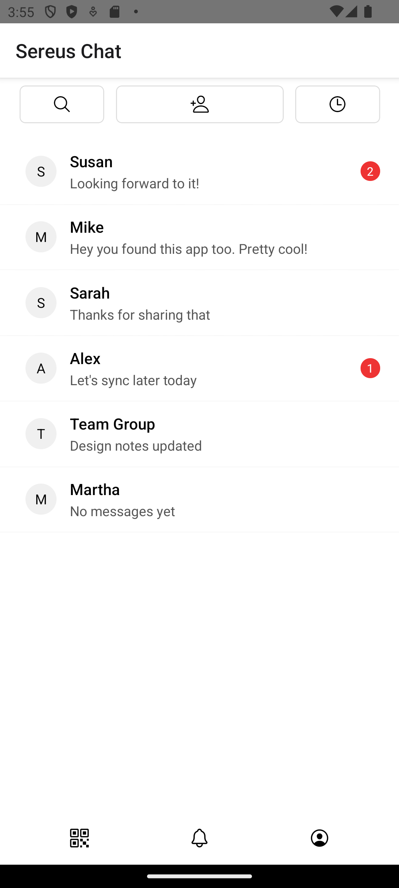
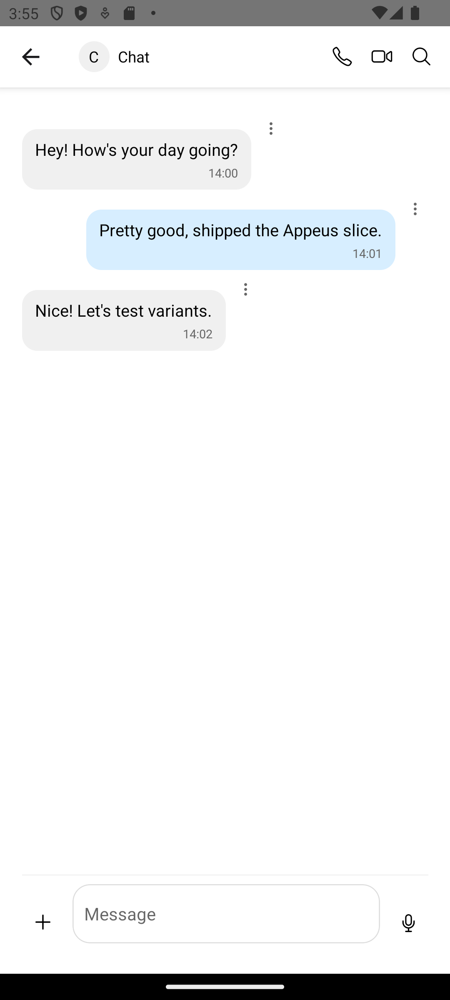

# Deleting Strands – Cleaning Up Old Conversations

Based on: `design/stories/deleting-channels.md`

Persona: Alex (returning user)  
Preconditions: locale=en

## 1) Review strands
Alex scans his list and notices an old conversation he no longer needs.

## 2) Open and choose delete
He opens the strand, taps the overflow menu, and chooses Delete. In a future build, a small confirmation will prevent accidents.

## 3) Strand removed
He returns to home and sees the cleaned list.

