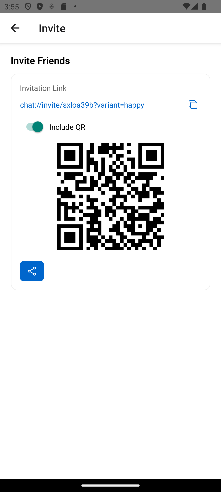

# Discovery – Inviting a Friend and Starting a Conversation

Based on: `design/stories/discovery.md`

Persona: Alex (new user)  
Preconditions: Alex has just installed the app; locale=en

## 1) First open – a clean slate
Alex opens the app and sees a calm empty home. There are no hebras yet, and the page gently invites him to add a friend.

## 2) Create an invitation
Alex taps Invite to generate a link he can share. He sees the link and a QR code he can show when they’re together.

## 3) Friend accepts
Maria taps the link and is welcomed to accept. She confirms, and they’re ready to chat.

## 4) Home now shows a strand
Back on Alex’s home, a new strand appears. It’s easy to spot and open.

## 5) Say hello
Alex opens the conversation and sends a quick greeting. Messages are easy to read and respond to.

---

Alternates
- QR in person: If they’re together, Maria scans Alex’s code instead of using the link.  
  

