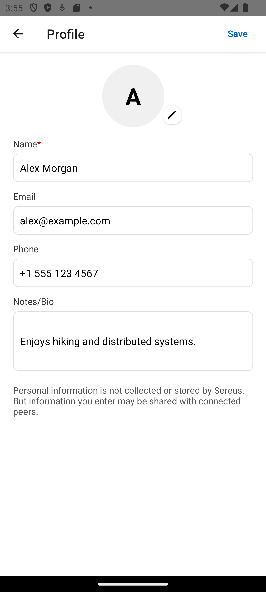

# Profile Management – Reviewing and Updating Details

Based on: `design/stories/profile-management.md`

Persona: Taylor (returning user)  
Preconditions: locale=en; mock mode (read-only persist)

## 1) Open Profile
Taylor opens Profile to review Name, Email, Phone, and Notes.

## 2) Update information
They adjust their Name and refine the Notes to better describe preferences.

## 3) Save and return
Taylor saves the changes and returns to the app’s home.

