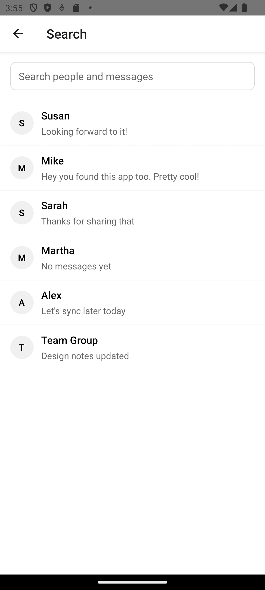

# Responding – Reading and Replying in a Strand

Based on: `design/stories/responding.md`

Persona: Alice (active participant)  
Preconditions: Alice and Susan have an ongoing conversation; locale=en

## 1) Pick up where you left off
Alice opens the strand with Susan and reviews the latest messages. Bubbles group by sender so it’s easy to follow the flow.

## 2) Send a quick reply
She types a short note and taps Send. Her message appears as an outgoing bubble at the tail of the conversation.

## 3) Find other conversations (optional)
If she needs another strand, Alice searches by name and opens the result she needs.

---

Alternates
- Empty strand: If there’s nothing yet, the conversation gently invites her to say hello.  
  

